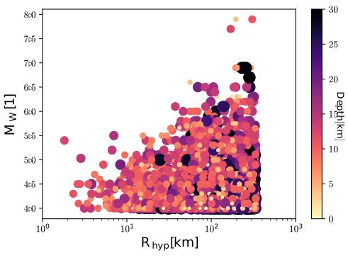

# SeismoALICE

Adversarially Learned Inference (ALI) + Conditional Entropy (CE) for prediction of seismic signals based on Physics-Based numerical simulations.

> [Gatti, F.](https://github.com/FilLTP89) and Clouteau, D. (2020). "Towards blending Physics-Based numerical simulations and seismic databases using Generative Adversarial Network". Submitted at Computer Methods in Applied Mechanics and Engineering, Special Issue: "AI in Computational Mechanics and Engineering Sciences". 
This work was inspired by the following original works:

[Adversarially Learned Inference with Conditional Entropy (ALICE)](https://github.com/ChunyuanLI/ALICE)
> Li, C. et al. (2017). "ALICE: Towards Understanding Adversarial Learning for Joint Distribution Matching". Duke University. NIPS, 2017. [https://arxiv.org/abs/1709.01215](https://arxiv.org/abs/1709.01215)

[DCGAN.torch: Train your own image generator](https://github.com/soumith/dcgan.torch)
> Radford, A. et al. (2015). "Unsupervised Representation Learning with Deep Convolutional Generative Adversarial Networks". ICLR 2016. [https://arxiv.org/abs/1511.06434](https://arxiv.org/abs/1511.06434)

[ANN2BB: NN-based broadband ground motion generator from 3D earthquake simulations](https://github.com/FilLTP89/ANN2BB.git)
> Paolucci, R., Gatti, F. et al. (2018). "Broadband Ground Motions from 3D Physics-Based Numerical Simulations Using Artificial Neural Networks". BSSA, 2018 [htt    ps://doi.org/10.1785/0120170293](https://doi.org/10.1785/0120170293)

## Getting Started

These instructions will get you a copy of the project up and running on your local machine for development and testing purposes. 

### Prerequisites

- Computer with Linux or OSX
- Torch

For training, an NVIDIA GPU is strongly recommended for speed. CPU is supported but training is very slow. GPU-based version was tested on `cuda 9.0`, `cuda 9.2`.
### Installing dependencies

Before getting started, some prerequisites must be installed via `pip`:

```
pip install -r requirements.txt
```

## Overview

Three Deep-Convolutional Adversarial AutoEncoders (DCAAE) can be trained and tested, according to the reconstruction frequency band:
    
 1. `broadband` (`bb`) seismic signals (0-30 Hz)
 2. `filtered` (`fl`) seismic signals (0-$f_C$ Hz, where fc can be set via `--cutoff` option
 3. `hybrid` (`hb`) seismic signals (0-$f_C$ + $f_C$-30 Hz)

Each `DCAAE` can undergo three different ``actions`` (to be listed in the `actions.txt` file [True/False])

 1. `tract`: train 
 2. `trplt`: plot/generate
 3. `trcmp`: compare with ANN2BB

Each action implies the choice of a corresponding `strategy` (to be specified in the `strategy.txt` file) for keywords `encoder`,`decoder` (...and others, see below) corresponding to the desired network (from scratch template or pre-trained model). For each keyword, two alternatives are possible:
    
 1. `None`: a generic `CNN` will be created, with random weights
 2. The path to pre-trained models (under `.pth` format) to be used in the analysis

Extra keywords can be added as column's headers in the `strategy.txt` file: they are needed for comparison purposes and/or to test the discriminator performances.
### Signal Databases

To train/test the different `DCAAE`, an extraction of 5000 signals from the [STEAD database](https://github.com/smousavi05/STEAD/) is provided in the `database` folder. Seismic signals are 40.96 s-long, sampled at 100 Hz (`nt`=4096 time steps).

 - `ths_trn_nt4096_ls128_nzf8_nzd32.pth`: training set (80%)
 - `ths_tst_nt4096_ls128_nzf8_nzd32.pth`: testing set  (10%)
 - `ths_vld_nt4096_ls128_nzf8_nzd32.pth`: validation set (10%)

`ls` : latent space vector size
`nzd`: latent space channels (`broadband`)
`nzf`: latent space channels (`filtered`)

<p align="center">
  
</p>

## 
